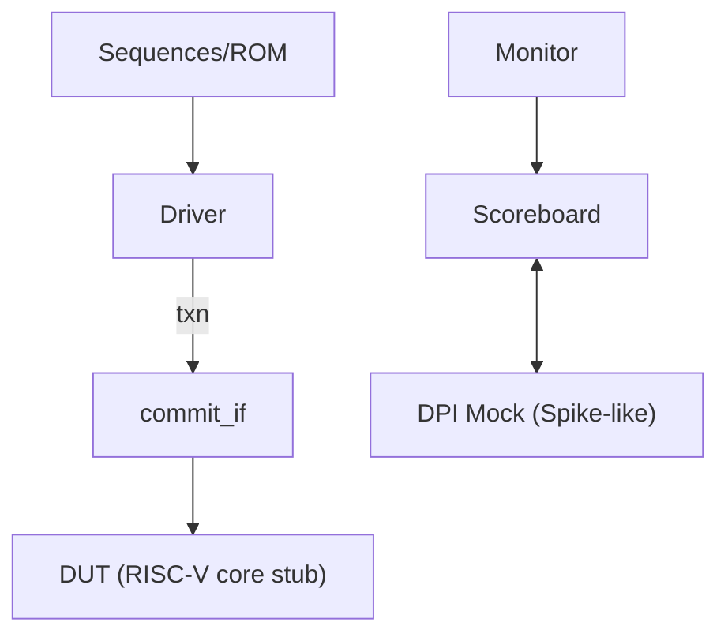

# RISC-V CPU Core — UVM-Based ISA Compliance Verification

[](#license)


A **minimal yet complete** UVM testbench for **RISC-V ISA compliance**.
We sample the core’s **commit/retire** interface and verify architectural state (PC, rd/val) using a **scoreboard** plus a **DPI (Spike-like) mock reference model**.


---

## Table of Contents

* [Goals](#goals)
* [Repository Layout](#repository-layout)
* [Architecture](#architecture)
* [How It Works](#how-it-works)
* [Quick Start](#quick-start)
* [Run Options](#run-options)
* [Key Files](#key-files)
* [DPI API (Mock Spike)](#dpi-api-mock-spike)
* [Results & Artifacts](#results--artifacts)
* [Scope vs Non-Scope](#scope-vs-non-scope)
* [Roadmap](#roadmap)
* [License](#license)

---

## Goals

* **Objective**: Check the CPU’s **ISA behavior** against a golden model at the **commit boundary**.
* **Signals**: `pc`, `insn`, `rd`, `val`, and a `commit_valid`/handshake.
* **MVP**: End-to-end runnable, clean structure, easy to extend to CSR/exception/interrupt/random programs.

---

## Repository Layout

```
hw/rtl/
  └─ riscv_core_top_stub.sv       # DUT (or a stub)

dv/
  ├─ include/
  │   └─ riscv_defs.svh           # typedefs/defines
  ├─ if/
  │   └─ commit_if.sv             # commit/retire interface
  ├─ env/
  │   └─ ref_env_pkg.sv           # env + test packaging
  ├─ scoreboard/
  │   └─ ref_scoreboard.sv        # golden comparison
  └─ dpi/
      ├─ spike_dpi_wrapper.sv     # SV DPI wrapper
      └─ spike_dpi.cc             # C++ mock (Spike-like)

sim/
  ├─ riscv_tb_top.sv              # testbench top
  ├─ run_vcs.sh
  └─ run_questa.tcl

tools/
  └─ regdiff.py

docs/                              # put screenshots/reports here
  ├─ waveform.png
  └─ coverage.png

Makefile                           # one-command build (VCS/Questa)
```

---

## Architecture



---

## How It Works

1. **Stimulus**: a smoke program/sequence runs on the core (or via a ROM).
2. **Monitor**: `commit_if.sv` exposes commit events (`pc/insn/rd/val/commit_valid`).
3. **Scoreboard**:

   * Calls the **DPI mock** to “execute” the same instruction;
   * Compares **rd/val/PC** at the commit boundary;
   * Logs mismatches and aggregates pass/fail statistics.
4. **Reports**: VCS can emit coverage (optional). Waveform/coverage screenshots live in `docs/`.

---

## Quick Start

> Requires **VCS (or Questa)** and **UVM-1.2**.

```bash
# VCS
make vcs
make cov           # optional: generate coverage report (VCS)

# Questa
make questa
```

---

## Run Options

```
+UVM_TESTNAME=riscv_smoke_test
+ntb_random_seed=<seed>
```

---

## Key Files

* **`dv/if/commit_if.sv`** — Commit/retire interface (PC, instruction, rd/val, valid).
* **`dv/scoreboard/ref_scoreboard.sv`** — Golden checking at commit boundary; queries the DPI mock and checks `rd/val/pc`.
* **`dv/dpi/spike_dpi_wrapper.sv` / `dv/dpi/spike_dpi.cc`** — SV DPI wrapper + **mock** C++ model (placeholder for Spike).
* **`sim/riscv_tb_top.sv`** — Connects DUT, interface, scoreboard, and DPI wrapper.
* **`Makefile` / `sim/run_vcs.sh` / `sim/run_questa.tcl`** — One-command flows for VCS/Questa.

---

## DPI API (Mock Spike)

The SV DPI signature is intentionally stable so a real Spike ISS can be dropped in later.

**SystemVerilog wrapper**

```systemverilog
// dv/dpi/spike_dpi_wrapper.sv
import "DPI-C" context function void spike_step_mock(
  input  int unsigned pc,
  input  int unsigned insn,
  output int unsigned rd,
  output int unsigned val
);
```

**C++ mock**

```cpp
// dv/dpi/spike_dpi.cc
#include <stdint.h>
extern "C" {
void spike_step_mock(uint32_t pc, uint32_t insn, uint32_t* rd, uint32_t* val) {
  *rd  = (insn >> 7) & 0x1f;  // pretend to decode rd
  *val = pc ^ insn;           // pretend to compute a result
}}
```

> To switch to a real Spike: provide `iss_init() / iss_load_elf() / iss_step()` in C/C++, keep this SV signature, and link the Spike library in the `Makefile`.

---

## Results & Artifacts

Place your screenshots in `docs/` and they’ll render here:

**Waveform**


**Coverage**


---

## Scope vs Non-Scope

**In scope (CPU ISA verification):**

* Golden checking at commit boundary: **PC / rd / val**
* Optional: extend to **exception/interrupt/CSR** later
* Smoke + seeds; functional/code coverage as available

**Out of scope (PCIe/others):**

* **PCIe** LTSSM, BAR decoding, flow-control credits, MSI/MSI-X, TLPs, link training/recovery

---

## Roadmap

* [ ] Expand functional coverage (opcode/funct3/funct7/branch outcome/CSR)
* [ ] Directed tests: smoke / branch / load-store / CSR / exception
* [ ] Random programs via **riscv-dv** or a lightweight instruction pool
* [ ] Replace the mock with a **real Spike ISS** (`iss_init / load_elf / step`)
* [ ] (Optional) UVM RAL for key CSRs; add CSR access checks & coverage
* [ ] (Optional) GitHub Actions: SV lint (verible) + Python smoke tests

---

## License

This project is licensed under the [MIT License](LICENSE).

---

**Tip:** if GitHub still renders the whole page as a single code block, it means the file you pasted had leading/back-tick fences. Replace your `README.md` content with the text above **exactly as-is** (no outer \`\`\` fences).
